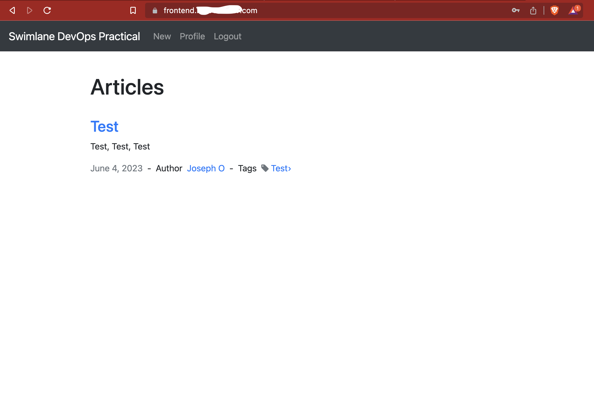

# SwimLane

This Terraform module packages a Helm chart of the SwimLane DevOps test, builds a Docker image of the Frontend, provisions a GKE cluster, and deploys the Helm chart to the cluster.

## Features

* Provides a Helm chart (`./include/helm/chart`) to provision the SwimLane DevOps test, includes:
    |             | Deployments | Services | Ingresses | Secrets | PVC's |
    |-------------|-------------|----------|-----------|---------|-------|
    |   MongoDB   |      ✅     |     ✅    |           |   ✅    |   ✅   |
    |   Frontend  |      ✅     |     ✅    |     ✅     |         |       |
* Provides Terraform code to provision a GKE Cluster along with other supporting resources, including a private Docker registry, an SSL cert and a static IP.
* Provides a Dockerfile to containerise the application code  (`./include/devops-practical/Dockerfile`) 


## Requirements

* Terraform version: ~> 1.4
* gcloud CLI (only required for Terraform , follow this link for setup instructions).
* Valid Google Cloud account (only required for Terraform, follow this link for setup instructions).

## Terraform version compatibility

| Module version | Terraform version |
|----------------|-------------------|
|      0.x.x     |      ~> 1.4       |

## Usage

```bash
git clone https://github.com/joeyomi/swimlane.git
cd swimlane
cp terraform.tfvars.example terraform.tfvars
# Add a valid GCP project ID to the tfvars file

terraform init
terraform plan
terraform apply --auto-approve

mv helm.tf.disabled helm.tf 
# If you have a Cloud DNS zone and would like to enabe SSL certs, you can use `helm-with-ssl.tf`.
# The GKE cluster has to be created first, the Helm provider depends on outputs from the GKE module.

terraform init
terraform plan
terraform apply --auto-approve
```

## Inputs/ Variables
| Name                | Description                                               | Type           | Default         | Required |
|-------------------- |---------------------------------------------------------- |--------------- |-----------------|----------|
| project_id          | GCP project id.                                           | `string`       | `""`            | Yes      |
| region              | GCP region for the persistent volumes and GKE cluster.    | `string`       | `"us-central1"` | No       |
| prefix              | Prefix to prepend to resources (for easy identification). | `string`       | `""`            | No       |
| enabled-apis        | Google Cloud API's to enable on the project.              | `list(string)` | `[]`            | No       |
| dns_zone_name       | Google Cloud DNS Managed Zone to create DNS records in.   | `string`       | `""`            | No       |
| dns_zone_project_id | Project ID of the Google Cloud DNS Managed Zone.          | `string`       | `""`            | No       |

An example tfvars file is available in `terraform.tfvars.example`.

```hcl
project_id = "swimlane-project"
region     = "us-central1"
prefix     = "swimlane"

enabled-apis = [
  "compute.googleapis.com",
  "container.googleapis.com",
  "cloudresourcemanager.googleapis.com",
  "artifactregistry.googleapis.com",
  "cloudbuild.googleapis.com",
  "privateca.googleapis.com",
]

#dns_zone_project_id = "swimlane"
#dns_zone_name       = "swimlane"

```

## Outputs
* No outputs


## Confirmation
<h1 align="center">
  <br/><br/>
</h1>